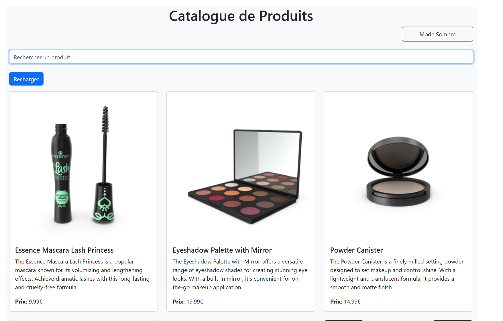
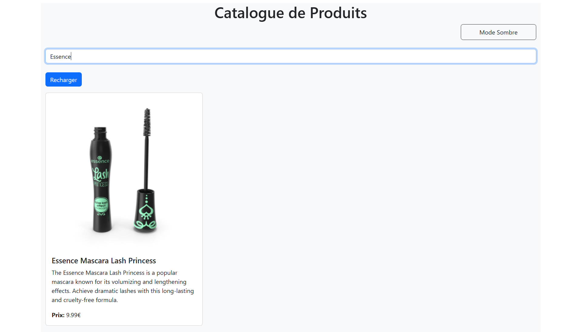
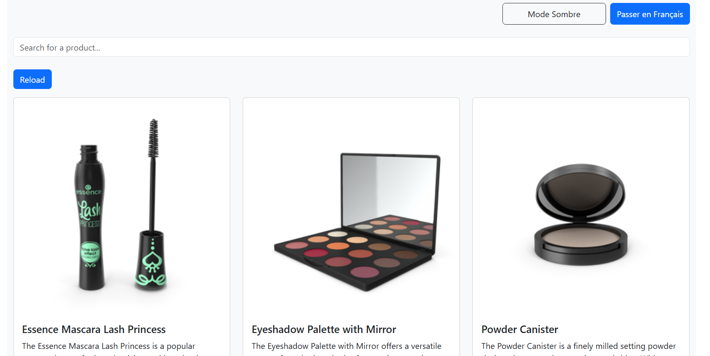
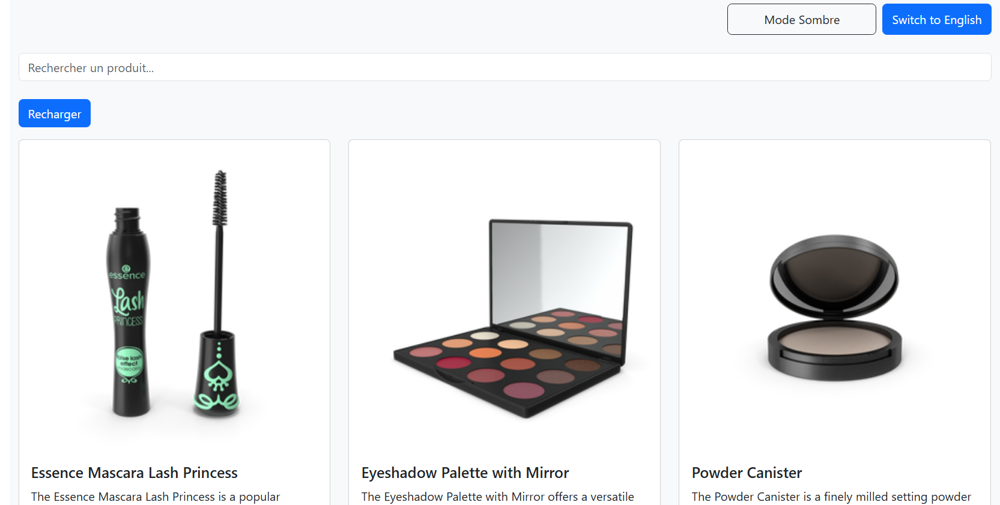
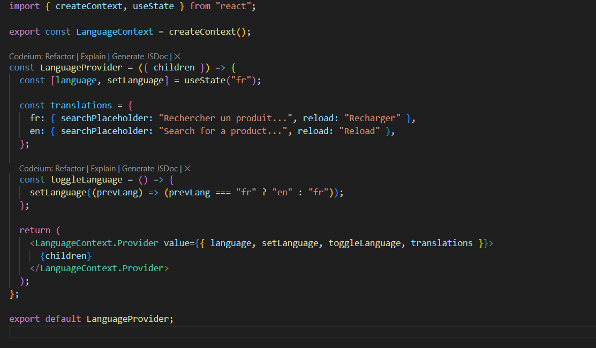
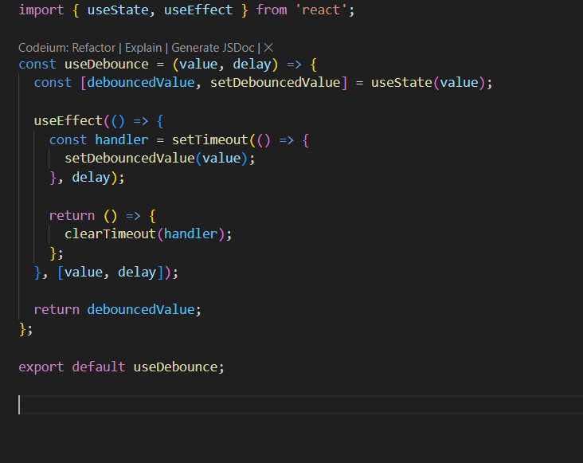
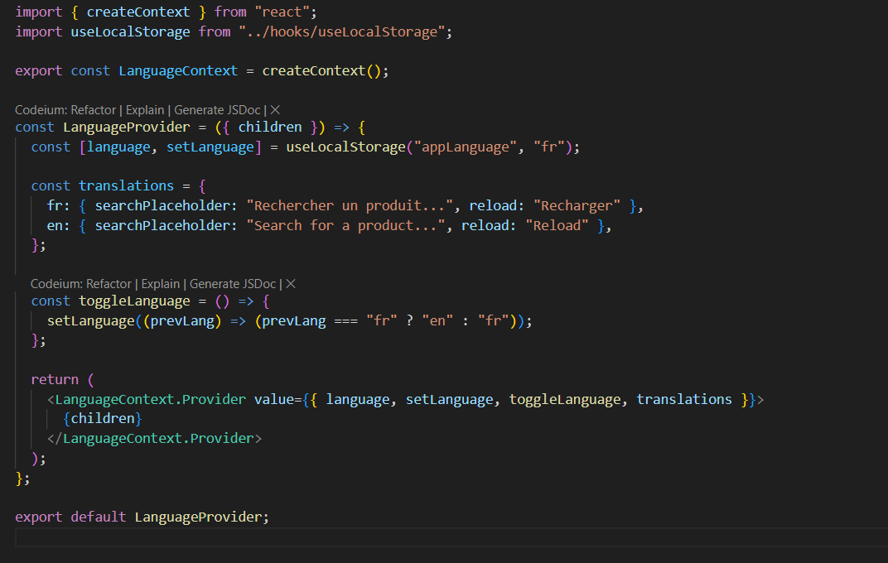

# TP React Hooks - Application de Gestion de Produits

Ce TP a pour objectif de mettre en pratique l'utilisation des Hooks React (useState, useEffect, useContext) ainsi que la création de Hooks personnalisés.

## Installation et configuration initiale

1. Cloner le dépôt :
```bash
git clone https://github.com/pr-daaif/tp-react-hooks.git
cd tp-react-hooks
```

2. Créer votre propre dépôt sur Github et changer le remote :
```bash
# Supprimer le remote origine
git remote remove origin

# Ajouter votre nouveau remote
git remote add origin https://github.com/[votre-username]/tp-react-hooks.git

# Premier push
git push -u origin main
```

3. Installer les dépendances :
```bash
npm install
```

4. Lancer l'application :
```bash
npm start
```

## Instructions pour le TP

Pour chaque exercice :
1. Lisez attentivement l'énoncé
2. Implémentez la solution
3. Testez votre implémentation (pensez à faire des copies d'écran)
4. Mettez à jour la section correspondante dans ce README avec :
   - Une brève explication de votre solution
   - Des captures d'écran montrant le fonctionnement
   - Les difficultés rencontrées et comment vous les avez résolues
5. Commitez vos changements avec un message descriptif

### Exercice 1 : État et Effets 
#### Objectif : Implémenter une recherche en temps réel

- [ ] 1.1 Modifier le composant ProductSearch pour utiliser la recherche
- [ ] 1.2 Implémenter le debounce sur la recherche
- [ ] 1.3 Documenter votre solution ici

_ réponse pour l'exercice 1 :_
Utilisation de `useState` et `useEffect` pour capturer la saisie utilisateur.  
Ajout de `useDebounce` pour retarder les requêtes et optimiser la recherche.

On a créé le hook useDebounce et l'utiliser en fichier séparé pour la possibilité de réutilisation.





### Exercice 2 : Context et Internationalisation
#### Objectif : Gérer les préférences de langue

- [ ] 2.1 Créer le LanguageContext
- [ ] 2.2 Ajouter le sélecteur de langue
- [ ] 2.3 Documenter votre solution ici

 réponse pour l'exercice 2 :_
Mise en place de `LanguageContext` pour stocker et changer la langue de l'application.
Ajout du composant `LanguageSelector` pour permettre le changement de langue par l'utilisateur.
useContext pour accéder à la langue active et la modifier via toggleLanguage.
useState pour stocker la langue sélectionnée.
LanguageProvider enveloppe l'application pour partager le contexte.
LanguageSelector permet de basculer entre Français et Anglais.






### Exercice 3 : Hooks Personnalisés
#### Objectif : Créer des hooks réutilisables

- [ ] 3.1 Créer le hook useDebounce
- [ ] 3.2 Créer le hook useLocalStorage
- [ ] 3.3 Documenter votre solution ici

_Votre réponse pour l'exercice 3 :_
Ona déjà créé useDebounce dans l'exercice 1, car il est essentiel d'optimiser au fur et à mesure.
Nous avons ajouté useLocalStorage pour stocker des valeurs de manière persistante.



- utilisation de local storage hook dans le context de langue



### Exercice 4 : Gestion Asynchrone et Pagination
#### Objectif : Gérer le chargement et la pagination

- [ ] 4.1 Ajouter le bouton de rechargement
- [ ] 4.2 Implémenter la pagination
- [ ] 4.3 Documenter votre solution ici

_Votre réponse pour l'exercice 4 :_
fetchProducts récupère les données en fonction de la page active.
setPage met à jour l’état de la pagination.
Ajout d’un bouton pour recharger les produits manuellement.
Pagination avec des boutons Précédent / Suivant et affichage du numéro de page.

Je n’ai pas commité chaque exercice séparément, car j’ai préféré me concentrer directement sur le développement. Revenir en arrière pour recréer artificiellement des commits n’aurait pas été pertinent. Étant donné que le projet est relativement léger et ne nécessite pas un contrôle de version rigoureux à ce stade, il m’a semblé plus naturel de tout implémenter en continu avant de réaliser un commit global. J’espère que cela ne posera pas de problème.


## Rendu

- Ajoutez l'URL de votre dépôt Github dans  **Classroom** et envoyer la réponse dès le démarage de votre projet.
- Les push doivent se faire au fûr et à mesure que vous avancez dans votre projet.
- Le README.md doit être à jour avec vos réponses et captures d'écran. 
- Chaques exercice doit faire l'objet d'au moins un commit avec un message mentionnant le numéro de l'exercice.
